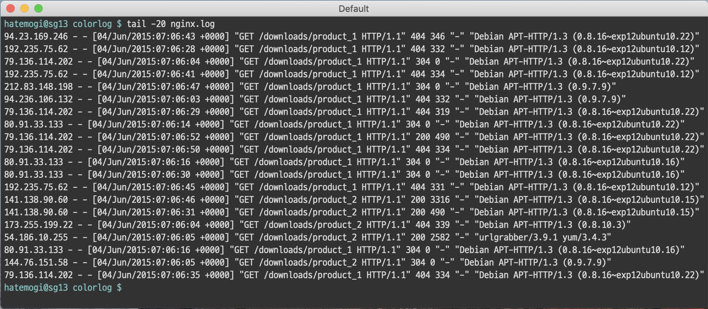
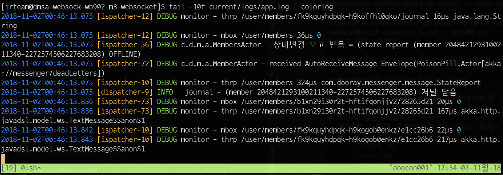

# 로그 파일 색칠러

단색 로그파일을 보느라 눈이 아팠던 분들을 위한 로그 파일 색칠러. 애플리케이션 로그나, 웹서버 접근 로그를 눈으로 보기 편하게 돕습니다.

## 분류패턴

> 정확도 보다는 (개발&실행) 속도 위주의 접근

* 숫자 (정수, 실수, 분수, 16진수)
* 시간 (날짜, 시간, 기간)
* UUID
* IP
* 따옴표, 대괄호, 중괄호, 괄호등 묶은 것

## 설치 방법

colorlog는 osx와 linux용 바이너리로 빌드해 두었으며, [릴리즈 페이지](https://github.com/hatemogi/colorlog/releases)에서 최신 바이너리를 다운로드해서 쓰시면 됩니다. static 바이너리라 별도의 디펜던시가 필요없습니다.

리눅스 서버에서는 아래 커맨드로 설치하셔서 $PATH가 걸려 있는 디렉토리 (예. `~/bin`)등에 옮겨주세요.

    $ curl -OL https://github.com/hatemogi/colorlog/releases/download/0.0.3/cl
    $ chmod +x cl

## 사용방법

colorlog는 STDIN의 입력을 나름대로 분석해서 `시간/IP/문자열/숫자/JSON 등`을 각각 다른 색상으로 출력합니다. 

    $ tail -f [YOUR_LOG_FILE] | grep --line-buffered [TARGET_WORD] | cl

## 사용 전과 후

### before 

    $ tail -f current/logs/app.log

### after

    $ tail -f current/logs/app.log | colorlog

