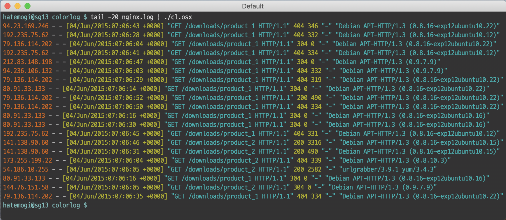

# 로그 파일 색칠러

단색 로그파일을 보느라 눈이 아팠던 분들을 위한 로그 파일 색칠러

## 경고

색칠한 게 더 눈이 아플 수도...

## 설치 방법

colorlog는 osx와 linux용 바이너리로 빌드해 두었으며, [릴리즈 페이지](https://github.com/hatemogi/colorlog/releases)에서 최신 바이너리를 다운로드해서 쓰시면 됩니다. static 바이너리라 별도의 디펜던시가 필요없습니다.

    > curl -OL https://github.com/hatemogi/colorlog/releases/download/0.0.1/colorlog
    > chmod +x colorlog

## 사용방법

colorlog는 STDIN의 입력을 나름대로 분석해서 `시간/IP/문자열/숫자/JSON 등`을 각각 다른 색상으로 출력합니다. 

    tail -f [YOUR_LOG_FILE] | colorlog

## 사용 전과 후

### before 

    tail -f current/logs/app.log

### after

    tail -f current/logs/app.log | colorlog

